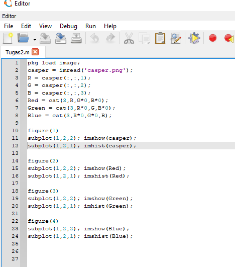
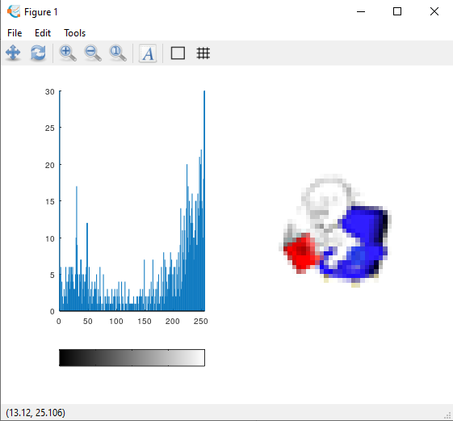
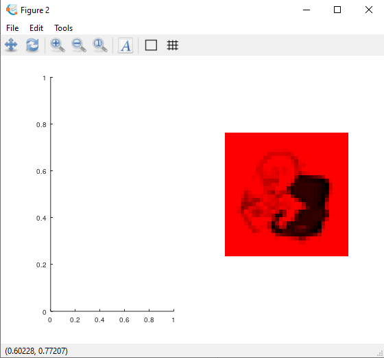
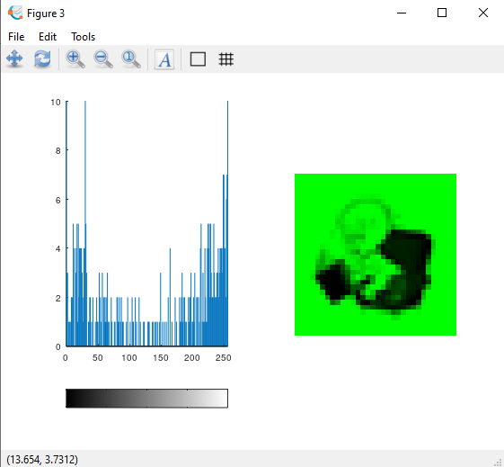
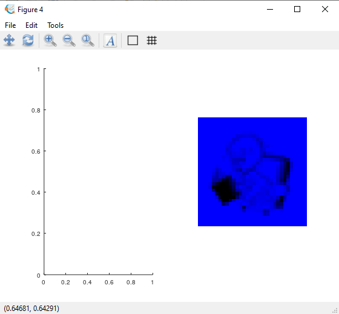

 
<h1 align="center">Explorasi Octave Dengan Package Image</h1>

## Bahan-Bahan Yang di perlukan
1. Gambar Berwarna dengan ukuran 32 x 32 ekstensi PNG/JPG/JPEG Format Warna RGB
2. Aplikasi Octave
3. Mendowload Package Image
## Screenshot Source Code

## Penjelasan Fungsi Yg Dipakai :
1. __imread__ : Fungsinya Membaca Sebuah File Gambar.
2. __imshow__ : Fungsinya Menampilkan Objek Gambar.
3. __imshist__ : Fungsinya Menampilkan Image Dalam Bentuk Histogram.

## Output Gambar :

 ### 1. Gambar Dan Histogram Dasar
 

 ### 2. Gambar Dan Histogram Merah 
 

 ### 3. Gambar Dan Histogram Hijau 
 

 ### 4. Gambar Dan Histogram Biru
 

