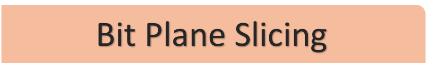

### Gambar yang digunakan :

untuk mengaplikasikan teknik <i>bit plane slicing</i> terhadap citra <i>grayscale</i> dengan menggunakan Octave.

Dengan Kode Program :

Penjelasan :

1. Membuat variabel gambar untuk membaca citra dengan menggunakan fungsi <b>imread</b>.
2. Mengubah citra berwarna menjadi citra grayscale atau abu-abu
menggunakan fungsi <b>>rgb2gray</b> yang disimpan ke dalam variabel <b>gambar_gray</b>.
3. Menyimpan nilai di variabel <b>row</b> dan <b>col</b> sesuai dengan ukuran/size dari gambar grayscale.
4. Terdapat <b>subplot(3, 3, 1)</b> dan <b>imshow(gambar_gray)</b> untuk menampilkan gambar grayscale dan meletakkan plot fungsinya pada bidang plot ukuran 3 baris dan 3 kolom di area ke-1.
5. Membuat keterangan gambar dengan menggunakan <b>tittle</b>.
6. Selanjutnya, membuat 8 matriks yang semua datanya bernilai 0 dengan kode <b>zeros(row, col, 8)</b>. Matriks memiliki jumlah baris dan kolom sesuai dengan nilai dari variabel <b>row</b> dan <b>col</b>. 8 matriks tersebut nantinya akan mewakili tiap-tiap lapisan.
7. Menggunakan perulangan untuk menampilkan semua lapisan.
8. Terdapat for i dengan kondisi loop 1-8, for j dengan kondisi loop 1-row (mewakili baris matriks), dan for k dengan kondisi loop 1-col (mewakili kolom matriks). 
9. Lalu terdapat kode <b>matriks(j, k, i) = bitget(gambar_gray(j, k), i)</b> untuk mengubah nilai dari setiap matriks 0 yang baru dibuat. Nilai matriks baris ke-j, kolom ke-k, dan lapisan ke-i akan diubah sama seperti nilai bitget dari gambar grayscale baris ke-j, kolom ke-k, dan lapisan ke-i.
10. Menggunakan <b>subplot(3, 3, i+1)</b> dan <b>imshow(:, :, i)</b> untuk menampilkan hasil tiap lapisan dan meletakkan plot fungsinya pada bidang plot ukuran 3 baris dan 3 kolom di area ke-i+1.
11. Membuat keterangan gambar dengan menggunakan <b>tittle</b>. Ubah angka (numbers) i ke dalam format string untuk memberikan keterangan urutan tiap lapisan.

Hasil Bit Plane Slicing

 

## Menggabungkan dengan Gambar Teman

### Gambar Saya :

### Gambar Delphia Aryana

## Kode Program :

<i>Bit Plane Slicing</i> Gambar yang Telah Digabung

 

Steganografi adalah sebuah metode dalam pemrosesan citra digital untuk menyembunyikan suatu data rahasia ke dalam sebuah citra. Data yang dapat disembunyikan berupa :

1. Gambar
2. Teks
3. Suara
4. dll.

Contoh mengaplikasikan metode steganografi terhadap citra gray_scale dengan menggunakan Octave.

Kode Program :

<h2 align="center">Hasil</h2>

