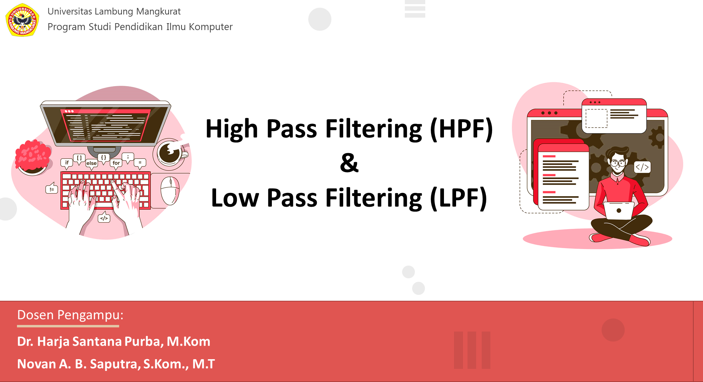
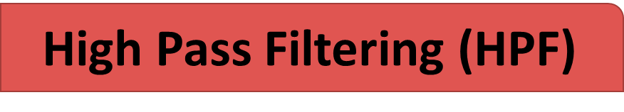
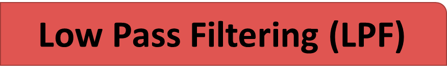

<i>High Pass Filter</i> (HPF) adalah proses filter yang mengambil citra dengan gradiasi intensitas yang tinggi dan perbedaan intensitas yang rendah akan dikurangi atau dibuang. <i>High Pass Filtering</i> adalah salah satu dari metode penajaman <i>(sharpening).</i> 

 Tujuan utama dari proses penajaman ini adalah untuk menyoroti detail-detail halus dalam gambar atau untuk meningkatkan detail yang telah dikaburkan baik dalam kesalahan atau efek alami dari proses akuisisi citra tertentu.

### __Kegunaan__

- __High-Pass Filter__ sering disebut juga sebagai filter penajaman tepi __(edge sharpening)__ karena HPF digunakan dalam proses penajaman citra. 
- Operasi penajaman citra bertujuan untuk memperjelas tepi pada objek di dalam citra atau menghilangkan bagian citra yang lembut.
- Karena penajaman citra lebih berpengaruh pada tepi __(edge)__ objek, maka penajaman citra sering disebut juga penajaman tepi __(edge sharpening)__ atau peningkatan kualitas tepi __(edge enhancement)__.

### __Aturan-Aturan Dalam High-Pass Filter__

1. Koefisien penapis boleh negatif, nol, ataupun bernillai positif.
2. Total keseluruhan koefisiennya ialah bernilai 0 ataupun 1.
3. Apabila jumlah koefisiennya berjumlah = 0, maka setiap elemen yang rendah frekuensinya nilainya akan menurun. 
4. Namun, apabila total dari koefisien adalah = 1, maka elemen yang memiliki frekuensi rendah nilainya tetap sama dengan nilai semula.

### __High Pass Filtering Menggunakan Octave__
 

### __Output :__
 

 
 

Low-pass filtering adalah proses filter yang melewatkan komponen citra dengan nilai intensitas yang rendah dan meredam komponen citra dengan nilai intensitas yang tinggi. Low pass filter akan menyebabkan citra menjadi lebih halus dan lebih blur.

### __Aturan Kernel untuk Low-Pass Filter__

1. Semua koefisien kernel harus positif
2. Jumlah semua koefisien kernel harus sama dengan 1

### __Low Pass Filtering Menggunakan Octave__

### output :

 

### Keterangan :
figure1 adalah gambar asli

figure2 adalah kernel1.

figure3 adalah kernel2.

figure4 adalah kernel3.
